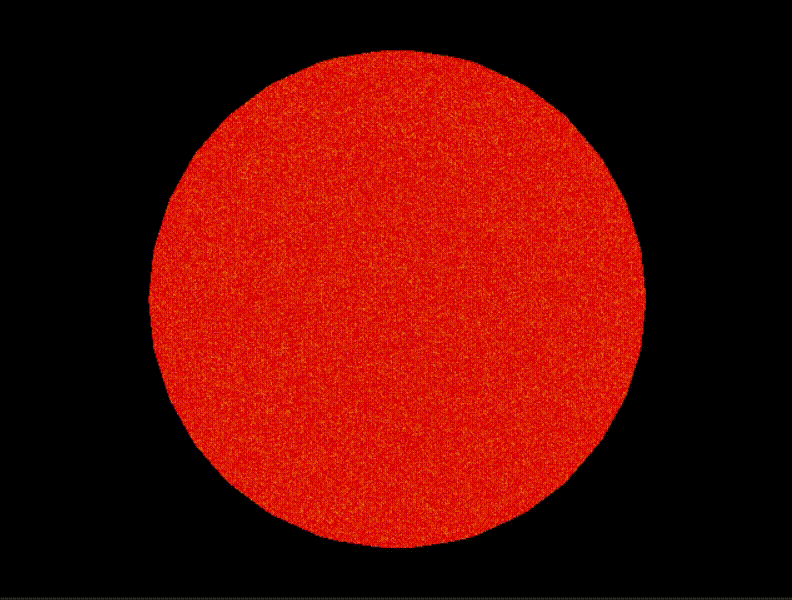
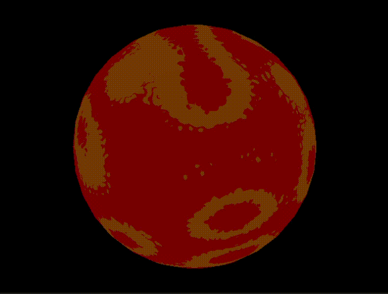
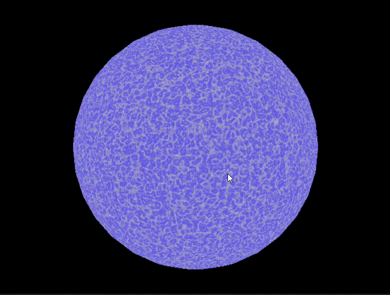
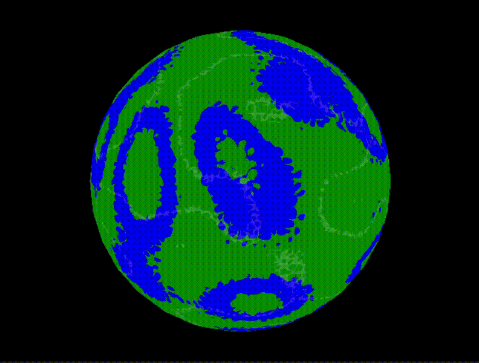
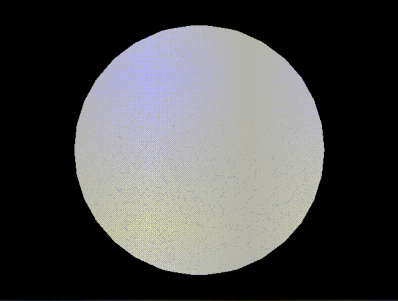
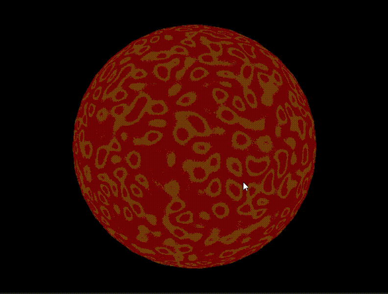

# Lab 4: Shaders

## Librerías y Constantes:
- Incluye varias librerías para funcionalidades como manejo de archivos, manipulación de matrices y vectores (glm), y gráficos (SDL).
- Define constantes como el ancho y alto de la ventana, y pi.

## Inicialización:
- Inicializa variables para el color de fondo, el renderer de SDL, la ventana, y una estructura `Uniform` que contiene matrices para transformaciones.

## Funciones de Interpolación:
- `interpolateColor`: Realiza interpolación de colores dados los vértices de un triángulo y las coordenadas bariocéntricas.
- `isBarycentricCoord`: Verifica si las coordenadas bariocéntricas están dentro del triángulo.

## Transformaciones y Matrices:
- `calculateBarycentricCoord`: Calcula las coordenadas bariocéntricas dadas las posiciones de tres vértices y una posición en pantalla.
- `createModelMatrix`, `createViewMatrix`, `createProjectionMatrix`, `createViewportMatrix`: Funciones para crear matrices de modelo, vista, proyección y viewport, respectivamente.

## Renderización:
- `render`: Renderiza un conjunto de vértices transformados, realiza la interpolación de color, calcula la intensidad de la luz, y aplica el sombreado.
- Utiliza un algoritmo de rasterización para determinar qué píxeles están dentro de un triángulo y los colorea en consecuencia.

## Función Principal:
- `main`: Inicializa SDL y la ventana, carga un modelo 3D desde un archivo OBJ, y entra en un bucle principal donde se renderiza continuamente el modelo con transformaciones y sombreado de Phong.

#SOl:

#MPlaneta Rocoso:

#Gigante Gaseoso:

#Tierra:

#Luna:

#Mercurio:

